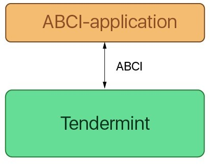
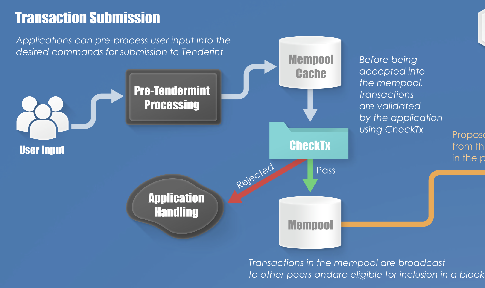
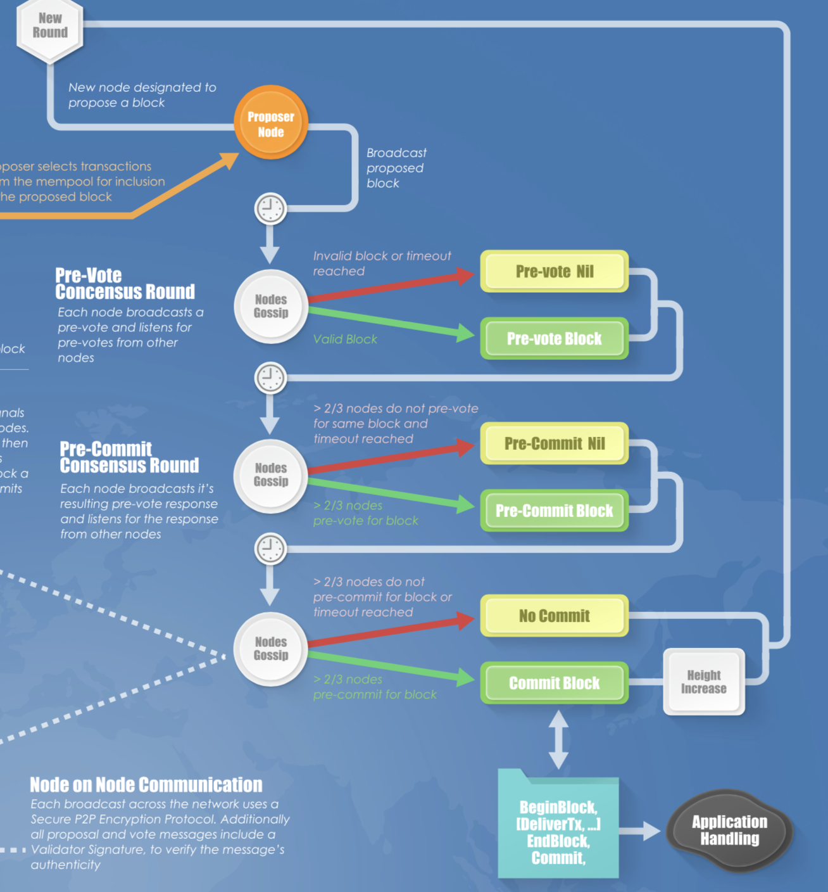

## tendermintの概要と利点について

## Tendermint coreとApplication logic間の通信について
Tendermint上で構築されるapplicationは、ABCI(Application BlockChain Interface)と呼ばれる独自のインターフェースを実装することで、相互に通信することができる。ABCIは、コンセンサスエンジンであるtendermint coreとアプリケーションロジックの間で、`message protocol`に従ってメッセージの交換を行う。

[](./img/tendermint.png)

`message protocol`では、必ずコンセンサスエンジンからアプリケーションロジックに対してリクエストを行い、そのレスポンスを返すようにルールで決まっている。具体的なリクエスト・リスポンスの形式は、[protobuf形式](https://github.com/tendermint/tendermint/blob/develop/abci/types/types.proto)で決められており、基本的にどのABCIのメソッドでも、リクエストを受け取り、リスポンスを返していることがわかる。

ABCIのメソッドは以下の3通りのコネクションに分類することができる。

- `consessus`コネクション:`InitChain, BeginBlock, DeliverTx, EndBlock, Commit`
- `mempool`コネクション:`CheckTx`
- `Info`コネクション:`Info, SetOption, Query`

`consessus`コネクションは、コンセンサスプロトコルによって行われ、ブロックの生成などを担う。`mempool`コネクションは、ブロックに格納される前の新しいトランザクションの検証を行う。そして、`Info`コネクションでは、ユーザーからのクエリに対応する。


**ABCIについて**
Ethermintやcosmos-sdk、Tendermintで使用されているgo言語は、厳密にはオブジェクト指向プログラミング言語ではないが、 インタフェースを用いることでポリモーフィズムを実現することができる。 Go言語ではインタフェースが必要とするメソッドをすべて実装した時点で、自動的にそのインタフェースを実装したとみなされるので、**Tendermintで言うところのABCIを実装するとは、 tendermintで定義されている`Info`や`CheckTx`、`DeliverTx`、`Commit`をはじめとするメソッドを実装するということ**になる。

実際にtendermintのコードを見てみると、以下のように、applicationのインターフェースが定義されているのがわかる。

```go:application.go
type Application interface {
	Info(RequestInfo) ResponseInfo               
	SetOption(RequestSetOption) ResponseSetOption
	Query(RequestQuery) ResponseQuery          
	CheckTx(tx []byte) ResponseCheckTx
	InitChain(RequestInitChain) ResponseInitChain    
	BeginBlock(RequestBeginBlock) ResponseBeginBlock
	DeliverTx(tx []byte) ResponseDeliverTx        
	EndBlock(RequestEndBlock) ResponseEndBlock      
	Commit() ResponseCommit                       
}
```
`CheckTx`と`DeliverTx`、`commit`を除き、他のメソッドでは、全て先ほど挙げた`message protocol`のリスポンスとリクエストの形式に沿ったstruct型の引数をとっているが確認できる。`CheckTx`と`DeliverTx`では、トランザクションがbyte形式で与えられており、`commit`は、引数を取らないメソッドになる。

## cosmos-sdkのbaseappにおけるabciの実装
application側のEthermintの方でABCIがどのように実装されているのかを見ていく前に、cosmos-sdkについて考えてみよう。Cosmos SDKは、Tendermint ABCI アプリケーションをGo言語で作るフレームワークである。Cosmos SDKを使うことで開発者は、簡単にCosmosネットワーク内でブロックチェーンアプリケーションを作ることができる。もちろん、ethermintでもcosmos-sdkが使用されている。

Cosmos SDK参考：https://cosmos.network/docs/sdk/overview.html

**Cosmos SDKのフォルダ構造**
- **baseapp**:基本的なABCIについて定めており、Tendermintのnodeとの通信を可能にする。
- **client**: CLI と REST サーバーのツールでアプリケーションとの通信を可能にする
- **examples**: アプリケーション構築の例(basecoinなど)
- **server**: Tendermint上でアプリケーションを動かすためのフルノードのサーバー
- **store**:SDKにおけるデータベース（Key-Value構造）
- **types**: SDKアプリケーションにおける一般的なtype
- **x**: 全てのメッセージとハンドラーが定められている。

cosmos-sdkの中でも、今回はABCIの設計を定めているbaseappを中心に見ていくとする。baseapp.goでは、まず、abciのアプリケーションの実装を反映したbaseAppのstructが定義されている。

```go:baseapp.go
type BaseApp struct {

	Logger      log.Logger
	name        string              
	db          dbm.DB              
	cms         sdk.CommitMultiStore
	router      Router              
	queryRouter QueryRouter         
	codespacer  *sdk.Codespacer      
	txDecoder   sdk.TxDecoder        

	anteHandler sdk.AnteHandler

	initChainer      sdk.InitChainer  
	beginBlocker     sdk.BeginBlocker
	endBlocker       sdk.EndBlocker   
	addrPeerFilter   sdk.PeerFilter  
	pubkeyPeerFilter sdk.PeerFilter

	checkState       *state                  
	deliverState     *state                  
	signedValidators []abci.SigningValidator

	sealed bool
}
```

さらに見ていくと、tendermintで定義されていたインターフェースのメソッドがcosmos-sdkの`baseapp`で実装されているのがわかる。例として、`InitChain`のコードをあげてみる。
```go:baseapp.go
func (app *BaseApp) InitChain(req abci.RequestInitChain) (res abci.ResponseInitChain) {
	app.setDeliverState(abci.Header{ChainID: req.ChainId})
	app.setCheckState(abci.Header{ChainID: req.ChainId})

	if app.initChainer == nil {
		return
	}
	res = app.initChainer(app.deliverState.ctx, req)
	return
}
```
`InitChain`の引数と返り値については、tendermintの方で定義されており、以下のように設定されている。

```go:types.pb.go
type RequestInitChain struct {
	Time                 time.Time        
	ChainId              string          
	ConsensusParams      *ConsensusParams  
	Validators           []ValidatorUpdate
	AppStateBytes        []byte            
	XXX_NoUnkeyedLiteral struct{}         
	XXX_unrecognized     []byte           
	XXX_sizecache        int32            
}

type ResponseInitChain struct {
	ConsensusParams      *ConsensusParams
	Validators           []ValidatorUpdate
	XXX_NoUnkeyedLiteral struct{}          
	XXX_unrecognized     []byte           
	XXX_sizecache        int32            
}
```
`InitChain`は、一番最初のみ呼び出されるメソッドで、`ResponseInitChain.Validators`が空の場合、最初のvalidator setは、`RequestInitChain.Validators`になる。`ResponseInitChain.Validators`が空でない場合は、`RequestInitChain.Validators`がセットされていたとしても、最初のvalidator setは、`ResponseInitChain.Validators`になる。したがって、application側で、tendermint側から提案された(genesis.jsonで定義された)validator setを使用するか、application側でvalidatorの定義をするか決めることができる。

`ValidatorUpdate`の構造体も見てみるTendermintの方で以下のように定義されている。
```go:types.pb.go
type ValidatorUpdate struct {
	PubKey               PubKey   
	Power                int64    
	XXX_NoUnkeyedLiteral struct{}
	XXX_unrecognized     []byte   
	XXX_sizecache        int32    
}
```
`ValidatorUpdate`では、validatorは、`pubKey`によって特定され、tendermint側にvalidator setの更新を伝える。`Power`は、そのvalidatorがPoSの投票システムの中でどのくらいの影響力を持っているかを示す指標になる。

## EthermintにおけるABCIの実装例
さて、ここまで、簡単にCosmos-SDKで実装されているABCIについて見てきたが、ここでの実装はあくまで最低限のベースになるものに過ぎず、本格的なABCIの実装に関しては、各アプリケーションのロジックを参照する必要がある。Ethermintでは、cosmos-sdkのbaseappをもとにしつつ、独自の構造体やkeeper、mapperを追加することで形成されており、Tendermintのコンセンサスに基づきながら、EthereumのEVMを使用してトランザクションの処理を行う。

### 構造体の構成要素

```go:ethermint.go
type (
	EthermintApp struct {
		*bam.BaseApp

		codec *wire.Codec
		ethDB *state.Database

		accountKey  *sdk.KVStoreKey
		storageKey  *sdk.KVStoreKey
		mainKey     *sdk.KVStoreKey
		stakeKey    *sdk.KVStoreKey
		slashingKey *sdk.KVStoreKey
		govKey      *sdk.KVStoreKey
		feeCollKey  *sdk.KVStoreKey
		paramsKey   *sdk.KVStoreKey
		tParamsKey  *sdk.TransientStoreKey

		accountMapper  auth.AccountMapper
		feeCollKeeper  auth.FeeCollectionKeeper
		coinKeeper     bank.Keeper
		stakeKeeper    stake.Keeper
		slashingKeeper slashing.Keeper
		govKeeper      gov.Keeper
		paramsKeeper   params.Keeper
	}
)
```
それでは具体的にみていこう。上記の`*bam.BaseApp`の部分で、事実上baseapp.goで定義されたbaseappの構造体を継承していることがわかる。それに加えて、状態遷移を保持するdatabaseや、通常のJSON decoderの代わりにcodecを定義している。

Ethermintでは、データベースとなるkvstoreに直接アクセスする形式ではなく、accountMapprを介して間接的にアクセスする仕組みを導入している。こうすることで、アクセス権を持つ人のみが任意のデータを取り出すことが可能になる。具体的には、accountMapperを通してGetAccountした後、Accountインターフェースで定義されているメソッドを使ってアカウント情報を編集することができるようになる。

```go:mapper.go
func (am AccountMapper) GetAccount(ctx sdk.Context, addr sdk.AccAddress) Account {
	store := ctx.KVStore(am.key)
	bz := store.Get(AddressStoreKey(addr))
	if bz == nil {
		return nil
	}
	acc := am.decodeAccount(bz)
	return acc
}
```

```go:account.go
type Account interface {
	GetAddress() sdk.AccAddress
	SetAddress(sdk.AccAddress) error

	GetPubKey() crypto.PubKey
	SetPubKey(crypto.PubKey) error

	GetAccountNumber() int64
	SetAccountNumber(int64) error

	GetSequence() int64
	SetSequence(int64) error

	GetCoins() sdk.Coins
	SetCoins(sdk.Coins) error
}
```

さらに、Mapperの上位概念のkeeperでは、kvstoreやmapperへのフルアクセスを防ぐために、特定の機能を果たす関数の使用を制限することができる。例えば、`FeeCollectionKeeper`では、feeの設定をするデータベースへのアクセス権をを示す`key`とアカウントのエンコード/デコードを行う`cdc`の設定を行い、マイニングが行われた時の手数料の設定をすることができるが、`slashingKeeper`で定義されていることへのアクセス権は認められていないなど。

```go:feekeeper.go
type FeeCollectionKeeper struct {
	key sdk.StoreKey
	cdc *wire.Codec
}
```


### 関数の構成
次に、ethermint.goの`NewEthermintApp`関数の中身を見ていく。
引数の`logger`と`db`は、tendermint上で定義されたインターフェースで、sdkAddrは、Ethereumで使われている20 bytesのアドレスを表している。返り値ではさきほど確認した`EthermintApp`の構造体のポインタが返される。

```go:ethermint.go
func NewEthermintApp(logger tmlog.Logger, db dbm.DB, sdkAddr ethcmn.Address) *EthermintApp {
	codec := CreateCodec()
	cms := store.NewCommitMultiStore(db)

	baseAppOpts := []func(*bam.BaseApp){
		func(bApp *bam.BaseApp) { bApp.SetCMS(cms) },
	}
	baseApp := bam.NewBaseApp(appName, logger, db, types.TxDecoder(codec, sdkAddr), baseAppOpts...)

	app := &EthermintApp{
		BaseApp:     baseApp, //
		codec:       codec,
		accountKey:  types.StoreKeyAccount,
		storageKey:  types.StoreKeyStorage,
		mainKey:     types.StoreKeyMain,
		stakeKey:    types.StoreKeyStake,
		slashingKey: types.StoreKeySlashing,
		govKey:      types.StoreKeyGov,
		feeCollKey:  types.StoreKeyFeeColl,
		paramsKey:   types.StoreKeyParams,
		tParamsKey:  types.StoreKeyTransParams,
	}
/*
           中略
*/
	return app
}
```

**Ethereumのstate データベースの生成**

```go:ethermint.go
ethDB, err := state.NewDatabase(cms, db, state.DefaultStoreCacheSize)
	if err != nil {
		tmcmn.Exit(err.Error())
	}

	app.ethDB = ethDB
```
データベースをappの中に付け加えている。データベースの実装については、database.goを参照のこと。
**mapperとkeeperの設定**
```go:ethermint.go
	app.accountMapper = auth.NewAccountMapper(codec, app.accountKey, auth.ProtoBaseAccount)
	app.coinKeeper = bank.NewKeeper(app.accountMapper)
	app.paramsKeeper = params.NewKeeper(app.codec, app.paramsKey)
	app.feeCollKeeper = auth.NewFeeCollectionKeeper(app.codec, app.feeCollKey)
	app.stakeKeeper = stake.NewKeeper(
		app.codec, app.stakeKey, app.coinKeeper, app.RegisterCodespace(stake.DefaultCodespace),
	)
	app.govKeeper = gov.NewKeeper(
		app.codec, app.govKey, app.paramsKeeper.Setter(), app.coinKeeper,
		app.stakeKeeper, app.RegisterCodespace(gov.DefaultCodespace),
	)
	app.slashingKeeper = slashing.NewKeeper(
		app.codec, app.slashingKey, app.stakeKeeper,
		app.paramsKeeper.Getter(), app.RegisterCodespace(slashing.DefaultCodespace),
	)
```
先ほど確認したmapperとkeeperを生成して代入している。

### `Router`によるhandlerの設定

```go:ethermint.go
	app.Router().

		AddRoute("stake", stake.NewHandler(app.stakeKeeper)).
		AddRoute("slashing", slashing.NewHandler(app.slashingKeeper)).
		AddRoute("gov", gov.NewHandler(app.govKeeper))
```
以下のコードの通り、`Router`は、インターフェースで、`AddRoute()`それぞれのトランザクションのタイプに合わせてhandlerを追加する役目を果たす。この場合は、`stake, slashing, gov`の３つの`route`が登録されたことがわかる。

```go:router.go
type Router interface {
	AddRoute(r string, h sdk.Handler) (rtr Router)
	Route(path string) (h sdk.Handler)
}

type route struct {
	r string
	h sdk.Handler
}

type router struct {
	routes []route
}
```

### ABCIのbaseappの初期化
```go:ethermint.go
	app.SetInitChainer(app.initChainer)
	app.SetBeginBlocker(app.BeginBlocker)
	app.SetEndBlocker(app.EndBlocker)
	app.SetAnteHandler(handlers.AnteHandler(app.accountMapper, app.feeCollKeeper))

	app.MountStoresIAVL(
		app.mainKey, app.accountKey, app.stakeKey, app.slashingKey,
		app.govKey, app.feeCollKey, app.paramsKey, app.storageKey,
	)
	app.MountStore(app.tParamsKey, sdk.StoreTypeTransient)

	if err := app.LoadLatestVersion(app.accountKey); err != nil {
		tmcmn.Exit(err.Error())
	}

	app.BaseApp.Seal()
```
ethermint.goの中で独自に定義されたメソッド(関数)`BeginBlocker, EndBlocker, initChainer, AnteHandler`をセットするとともに`MountStoresIAVL`では、kvstoreの中身を最新の状態にする。

基本的にここまでで、ethermint.goの基本的なコードの理解はできる。ここから、わかることとして、ABCIの実装は、cosmos-sdkをベースにしつつも、アプリケーション側にABCIを実装しているところが存在する。特に、etherrmintの場合は、**typesのフォルダの中に独自の実装している**のがうかがえる。例えば、ethermintにおけるトランザクションの型は、ethereumのそれと同様である必要があるが、それは、`types/tx.go`で記述があり、go-ethereum内のtransaction.goと比べても全く同じ構成になっていることがわかる。

```go:tx.go
type Transaction struct {
	data txdata
	hash atomic.Value
	size atomic.Value
	from atomic.Value
}

type txdata struct {
	AccountNonce uint64         
	Price        *big.Int     
	GasLimit     uint64        
	Recipient    *common.Address
	Amount       *big.Int    
	Payload      []byte    

	V *big.Int
	R *big.Int
	S *big.Int

	Hash *common.Hash
}
```

##  Ethermint(tendermint)で今後実装されていくと期待される部分
**手数料(Fee)の設定**
tendermintにおいて、コンセンサスエンジンから送られてきた`checkTX, deliverTX`に対してアプリケーションロジックからは`ResponseCheckTx`と`ResponseDeliverTx`が返される。両者には、`GasWanted`, `GasUsed`のフィールドが存在するが、現在は無視されており、tendermintは事実上手数料がない状態で稼働している。手数料がかからないネットワークの場合、DDoS攻撃をはじめとして、悪意があるノードから攻撃を受ける可能性が発生する。したがって、将来的にはネットワーク手数料になりうる物を実装する必要がある。tendermintでは、github上の[issue](https://github.com/tendermint/tendermint/issues/1861)で実際に議論が進んでおり、feeのフィールドを使わない代わりに`priority`という仕組みの導入が考えられている。

**validator setの設定**
`InitChain`のところで述べた通り、validator setの定義は、アプリケーション側で行わない場合、tendermint側のgenesis.jsonに依存する。現状では、ethermintのコードからvaliator setについて定めた箇所が見当たらなかったので、事実上実装されていないと考えられる。しかしながら、将来的にはcosmosプロジェクトで進行中のように、ethermintでもパブリックチェーンとしてアプリケーション側で規定したvalidatorを増やしていくと思われる。開発の進行具合によっては、今後cosmos validatorがそのままethermintのvalidatorも兼任するなどといったことが起きる可能性もある。

**clientとdeamonの設定**
`emintcli, emintd`と呼ばれるクライアントとデーモンが未実装であるので、現在のethermintは、コンソールから操作するといったことができない。[cobra](https://github.com/spf13/cobra)などのgo言語のパッケージを使ってクライアントを実装することが今後必要になる。


## Tendermint上でのトランザクションの流れ
Ethermintに限らず、Tendermint上で実装されたアプリケーションは以下のような流れに従い、トランザクションが処理される。

参照：https://github.com/devcorn/hackatom/blob/master/tminfo.pdf

- アプリケーション側のユーザーによって、トランザクションが生成され、アプリケーションのクライエントからデーモンに対してデータの書き込みが行われる。
- デーモン側でクライアントの要求を受け取り、Mempool Cacheにトランザクションを流す。
- CheckTxを使ってアプリケーションロジック側でトランザクションの検証が行われる(**mempool コネクション**)
- 検証をpassした場合、トランザクションはmempoolに移動し、検証を通らなかったトランザクションは棄却される

[](./img/transaction-flow1.png)

- validator(proposer)によって提案されたブロックがtendermintの3相コミットのアルゴリズムに基づき他のvalidator間でコンセンサスが取られる

[](./img/transaction-flow2.png)

- validatorは、abci-cliを使って、BeginBlock, DeliverTx…EndBlock, Ciommitをアプリケーションロジック側に送る(**consensus コネクション**)
- アプリケーションロジック側では、トランザクションの状態更新・validator setの更新を行い、その情報をtendermint側に返す
- 各Validatorは、新しいブロックを自身のDBに格納する。

[](./img/abci.png)

興味深いことに、tendermintではすでにブロックの形式は決まっており、アプリケーション側はABCIを実装することを通してそれに合うような形式のトランザクションを生成する必要があるということだ。そうすれば、どのようなトランザクションであっても、tendermint上では規定された通りのブロックが生成されることになり、コンセンサスレイヤーにおいて、アプリケーション側は、何も実装しなくて済むという恩恵を受けることができる。

## メモ
codecについて
antehandlerについて
DecodeRLPについて
ed25519について
databaseの実装の中身
hadlerの実装の中身
beginblock, endblockの実装の中身
deliverTX, checkTXの実装の中身
